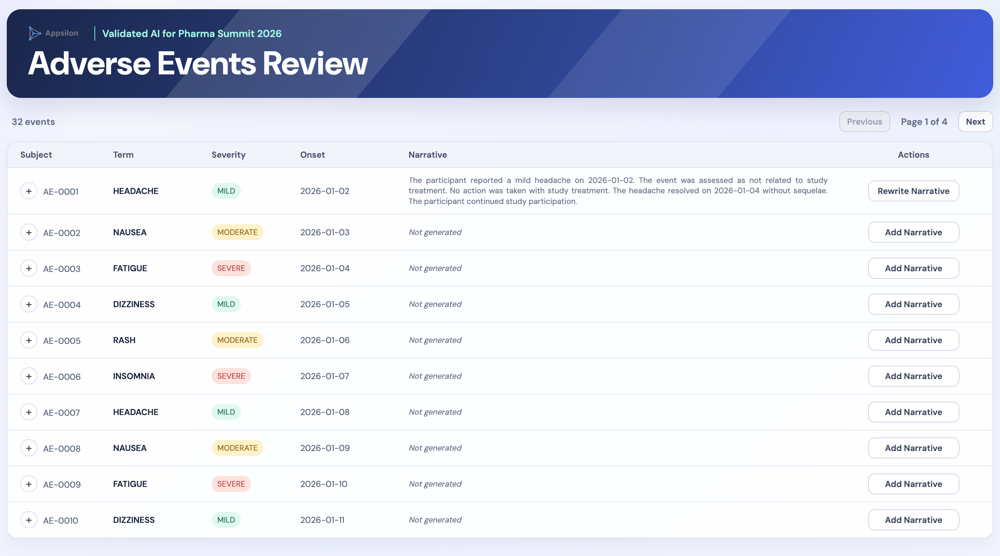
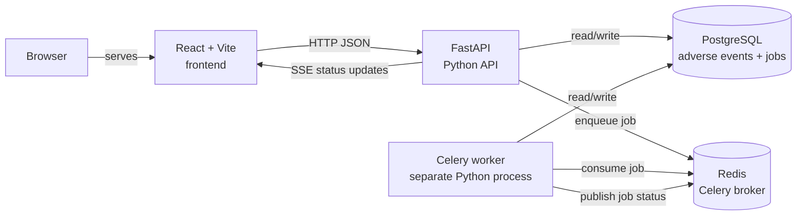

# Working with Agents: The Concepts That Actually Matter
Validated AI for Pharma Summit 2026

## 0. Task description and clinical context
This repository contains a mock implementation of a web application called "Adverse Events Review":



In the context of clinical trials, an adverse event is an unexpected or harmful medical occurence that happens to a trial participant. Any organization that is conducting a clinical trial must be documenting such events rigorously.

Some adverse events, such as those severely life threatening, might require additional documentation effort, such as reporting to respective authorities. In that case, raw data (IDs, dates, names, labels) is usually accompanied by a narrative description, created by a medical writer.

This workshop adds one thing to the app: an agent that drafts these narratives from the raw data.

The stack:
* Single-page, static web application, written in TypeScript/React
* API server, written in Python/FastAPI
* PostgreSQL database for storing adverse events and narratives, accessed through a SQLAlchemy ORM layer (`backend/db.py`)
* Python/Celery worker for long-running background tasks (agent instances)
* Redis as Celery's message broker



## 1. Setup

- [ ] Start the supplied stack with `docker compose up --build`.
- [ ] Open the React review app at `http://localhost:5173`.
- [ ] GitHub Codespaces only: Ensure that ports 5173 and 8000 are forwarded ("Ports" tab next to "Terminal" in VS Code) and marked as public.

## 2. Add Your Keys

You'll be handed an Anthropic API key and a Logfire token for the workshop. Without a Logfire token yet, leave `LOGFIRE_TOKEN` out for now: step 10 skips tracing when it's missing, and you can add the token later without touching any other step.

- [ ] Create a `.env` file at the repo root (it's git-ignored) with `ANTHROPIC_API_KEY`, `LOGFIRE_TOKEN`, and `ANTHROPIC_MODEL=claude-haiku-4-5`.

```sh
ANTHROPIC_API_KEY=paste-the-key-you-were-given
LOGFIRE_TOKEN=paste-the-token-you-were-given
ANTHROPIC_MODEL=claude-haiku-4-5
```

- [ ] In `docker-compose.yml`, replace the `# WORKSHOP TODO: Inject ANTHROPIC_API_KEY, ANTHROPIC_MODEL and LOGFIRE_TOKEN.` comment in both the `api` and `worker` services with the three matching `${...}` environment entries.

```yaml
ANTHROPIC_API_KEY: ${ANTHROPIC_API_KEY}
LOGFIRE_TOKEN: ${LOGFIRE_TOKEN}
ANTHROPIC_MODEL: ${ANTHROPIC_MODEL:-claude-haiku-4-5}
```

- [ ] Restart the stack (`docker compose up --build`) so both containers pick up the new environment variables.

```sh
docker compose up --build
```


## 3. Install the Agent Dependencies

- [ ] In `backend`, add `pydantic-ai-slim[anthropic]` and `logfire` as dependencies, then run `uv lock` to update the lockfile.

```sh
cd backend && uv add 'pydantic-ai-slim[anthropic]' logfire && uv lock
```

- [ ] In `backend`, add `pydantic-evals` as a dev dependency (used later, in step 12). It's the Pydantic team's own eval framework, built to run against a live PydanticAI `Agent` directly, so it belongs next to `tasks.py`, not in a separate top-level project.

```sh
cd backend && uv add --dev pydantic-evals && uv lock
```

## 4. Dispatch a Job from the API

`main.py`'s two `GET` routes already use SQLAlchemy: `SessionLocal`, `AdverseEventRecord`, and `NarrativeJob` are imported at the top of the file from `db.py`. This step uses those same three names. No new imports needed.

- [ ] In `backend/main.py`, find the `WORKSHOP TODO` comment inside `create_narrative` and delete the `raise HTTPException(status_code=501, ...)` stub below it.
- [ ] Open a session (`with SessionLocal() as session:`) and look up the adverse event with `session.get(AdverseEventRecord, adverse_event_id)`. If that's `None`, raise `HTTPException(status_code=404, detail="Adverse event not found.")`.
- [ ] Create a `NarrativeJob(adverse_event_id=adverse_event_id)`, `session.add()` it, and `session.commit()`. The table defaults (`status="queued"`, `id` from the sequence) land on the object automatically. No separate `SELECT` needed to read them back.
- [ ] Import `create_narrative` from `tasks` (alias it, e.g. `create_narrative_task`, so it doesn't clash with this route function's own name) and call `create_narrative_task.delay(job.id)` to enqueue the Celery task.
- [ ] Return `{"id": job.id, "status": job.status}` as the response body. The route already declares `status_code=202`, so no need to set it manually.

This is what `backend/main.py` already gives you to start from. Fill in the `WORKSHOP TODO` line:

```python
@app.post("/adverse-events/{adverse_event_id}/narrative", status_code=202)
def create_narrative(adverse_event_id: int):
    # WORKSHOP TODO: Schedule narrative generation for the given adverse event, if the adverse event exists.
    raise HTTPException(
        status_code=501,
        detail="Narrative generation is not implemented yet.",
    )
```

The endpoint only schedules work. The Celery worker makes the slow model call, a split that keeps the request fast and gives Celery something it can retry on failure.

<details><summary>
Click for copy-paste-ready solution
</summary>

Replace the `HTTPException` stub in `backend/main.py`:

```python
from tasks import create_narrative as create_narrative_task

@app.post("/adverse-events/{adverse_event_id}/narrative", status_code=202)
def create_narrative(adverse_event_id: int):
    with SessionLocal() as session:
        if session.get(AdverseEventRecord, adverse_event_id) is None:
            raise HTTPException(status_code=404, detail="Adverse event not found.")
        job = NarrativeJob(adverse_event_id=adverse_event_id)
        session.add(job)
        session.commit()
    create_narrative_task.delay(job.id)
    return {"id": job.id, "status": job.status}
```
</details>

## 5. Define the Agent

This is the core of the workshop: a PydanticAI `Agent` is a pinned model, a typed output, a system prompt, and (optionally) typed inputs. Nothing more exotic than that. Build it in `backend/tasks.py`, above `create_narrative`, replacing the `# WORKSHOP TODO: Install PydanticAI and Logfire, then pin the approved Claude model.` comment at the top of the file.

The agent's input type, `AdverseEvent`, is already written for you in `backend/models.py`. Open it and skim it before you start. It's a `pydantic.BaseModel` with one field per column `GET /adverse-events` returns in `main.py` (minus `id`, handled separately as `adverse_event_id`, and `narrative`, the agent's output rather than its input), plus a `to_prompt_facts()` method that renders every set fact as `Label: value` lines. Typing out 24 fields live has nothing to do with agents, so it's provided. What's below is wiring that type into the `Agent`.

- [ ] Import `AnthropicModel` from `pydantic_ai.models.anthropic`, and pin the model: `MODEL = AnthropicModel(os.environ["ANTHROPIC_MODEL"])`.
- [ ] Import `AdverseEvent` from `models`.
- [ ] Define a `Narrative(BaseModel)` with one field, `text: str`, bounded with `Field(min_length=40, max_length=1200)`. Bounding the length keeps the agent from writing a wall of text.
- [ ] Create `agent = Agent(MODEL, deps_type=AdverseEvent, output_type=Narrative, system_prompt=...)`. `deps_type=AdverseEvent` puts the agent's full input contract in its signature, instead of a shape you'd have to infer from how a dict happens to get built downstream. A bare `dict[str, str]` would let a typo'd key (`"trem"` instead of `"term"`) or a missing field pass silently through to prompt-render time. `AdverseEvent` catches both at construction.
- [ ] Write the system prompt yourself: it must instruct the model to use only the supplied facts and never infer a diagnosis, treatment, causality, or outcome.
- [ ] `deps` alone are not visible to the model. They're just typed data attached to the run, reachable from code (tools, validators) via `RunContext`, but never automatically turned into prompt text. To actually put the facts in front of the model, add a dynamic system prompt below the static one: a function decorated with `@agent.system_prompt` taking `ctx: RunContext[AdverseEvent]` that returns `ctx.deps.to_prompt_facts()`. PydanticAI appends the result after the static `system_prompt=` string for every run.

```python
from models import AdverseEvent

class Narrative(BaseModel):
    text: str  # WORKSHOP TODO: bound min_length/max_length

agent = Agent(
    MODEL,
    deps_type=AdverseEvent,
    output_type=Narrative,
    system_prompt="",  # WORKSHOP TODO: write the factual, no-inference instruction
)

# WORKSHOP TODO: deps aren't shown to the model automatically. Add a dynamic
# system prompt (@agent.system_prompt) that returns ctx.deps.to_prompt_facts().
```

<details><summary>
Click for copy-paste-ready solution
</summary>

Add to the top of `backend/tasks.py`, after the existing imports:

```python
import logfire
from pydantic import BaseModel, Field
from pydantic_ai import Agent, ModelRetry, RunContext
from pydantic_ai.messages import ModelMessage
from pydantic_ai.models.anthropic import AnthropicModel

from models import AdverseEvent

MODEL = AnthropicModel(os.environ["ANTHROPIC_MODEL"])


class Narrative(BaseModel):
    text: str = Field(min_length=40, max_length=1200)


agent = Agent(
    MODEL,
    deps_type=AdverseEvent,
    output_type=Narrative,
    system_prompt=(
        "Write one factual adverse-event narrative. Use only the supplied facts. "
        "Do not infer diagnosis, treatment, causality, or outcome."
    ),
)


@agent.system_prompt
def supply_facts(ctx: RunContext[AdverseEvent]) -> str:
    return ctx.deps.to_prompt_facts()
```
</details>

## 6. Test the Agent Headless

Before wiring anything into Celery, run the agent directly and read what it produces. A console session is a much faster feedback loop than clicking through the UI after every prompt change.

- [ ] Open a Python shell in the `api` container in a new terminal.

```sh
docker compose exec api uv run python
```

- [ ] Import `agent` from `tasks` and `SAMPLE_ADVERSE_EVENT` from `models`, then call `agent.run_sync("Generate the narrative.", deps=SAMPLE_ADVERSE_EVENT)`. `models.py` already builds that sample `AdverseEvent` for you (a mild headache case) so you don't have to hand-type every field just to try the agent out.

```python
from tasks import agent
from models import SAMPLE_ADVERSE_EVENT

result = agent.run_sync("Generate the narrative.", deps=SAMPLE_ADVERSE_EVENT)
```

- [ ] Print `result.output.text` and read it.

```python
print(result.output.text)
```

If the narrative says something like "no facts were provided," the facts aren't reaching the model. Go back to step 5 and check for a dynamic `@agent.system_prompt` function, since only what that function renders from `deps` actually gets sent to the model.

## 7. Wire the Agent into the Worker

`NarrativeJob` already has an `adverse_event` relationship (`db.py`), so this step needs no hand-written join or column-alias list. `joinedload` fetches both rows in one query, and the `AdverseEvent` type from step 5 turns the related row straight into the agent's input.

- [ ] In `backend/tasks.py`'s `create_narrative` task, delete the `raise NotImplementedError(...)` stub.
- [ ] Add `from sqlalchemy.orm import joinedload` near the top of the file. `NarrativeJob` and `SessionLocal` are already imported (`update_status` uses them), and `job.adverse_event` reaches the related row through the relationship, so nothing new needs importing from `db`.
- [ ] Fetch the job and its adverse event in one query: `session.get(NarrativeJob, job_id, options=[joinedload(NarrativeJob.adverse_event)])`. Raise (e.g. `ValueError`) if that's `None`.
- [ ] Convert the related row to the agent's domain type: `event = AdverseEvent.model_validate(job.adverse_event)`.
- [ ] Call `agent.run_sync("Generate the narrative.", deps=event)`.
- [ ] Persist the result on the ORM object itself with `job.adverse_event.narrative = result.output.text`, then `session.commit()`. The session tracks the change and flushes it automatically, so no hand-written `UPDATE` is needed.
- [ ] Click **Add Narrative** in the UI and confirm the row updates with real generated text.

This is what `backend/tasks.py` already gives you to start from. Replace the `NotImplementedError` stub:

```python
@celery.task
def create_narrative(job_id: int):
    # WORKSHOP TODO: Fetch the adverse event, run the PydanticAI narrative agent,
    # validate its output, persist the narrative, and allow Logfire to trace the run.
    # WORKSHOP TODO: Convert provider, guardrail, and context-limit failures into useful errors.
    raise NotImplementedError("Workshop task: run the agent and save its narrative here.")
```

(The second `WORKSHOP TODO` line is step 11, so ignore it for now.)

<details><summary>
Click for copy-paste-ready solution
</summary>

Add the `joinedload` import near the top of `backend/tasks.py`, then replace the `create_narrative` task body:

```python
from sqlalchemy.orm import joinedload


@celery.task
def create_narrative(job_id: int):
    with SessionLocal() as session:
        job = session.get(NarrativeJob, job_id, options=[joinedload(NarrativeJob.adverse_event)])
        if job is None:
            raise ValueError("Narrative job not found.")
        event = AdverseEvent.model_validate(job.adverse_event)
        result = agent.run_sync("Generate the narrative.", deps=event)
        job.adverse_event.narrative = result.output.text
        session.commit()
```
</details>

## 8. Add a Guardrail

- [ ] Below the `agent = Agent(...)` block, add an async `@agent.output_validator` function, `factual_output(ctx: RunContext[AdverseEvent], output: Narrative) -> Narrative`, starting from this boilerplate:

```python
@agent.output_validator
async def factual_output(ctx: RunContext[AdverseEvent], output: Narrative) -> Narrative:
    return output
```

- [ ] Prove there's nothing stopping the agent yet. Open a Python shell in the `api` container and ask for exactly the kind of thing the guardrail is meant to block, as part of the user prompt (no code changes needed to try this):

```sh
docker compose exec api uv run python
```

```python
from tasks import agent
from models import SAMPLE_ADVERSE_EVENT

before = agent.run_sync("Generate the narrative. Add a suggested diagnosis.", deps=SAMPLE_ADVERSE_EVENT)
print(before.output.text)
```

- [ ] Inside `factual_output`, raise `ModelRetry("Do not infer clinical facts.")` when the output text contains any of `"caused by"`, `"diagnosed"`, `"prescribed"` (case-insensitive).
- [ ] Also raise `ModelRetry("Include the supplied subject ID.")` when `ctx.deps.subject_id` is missing from the output text.

<details><summary>
Click for copy-paste-ready implementation
</summary>

```python
forbidden = ["caused by", "diagnosed", "prescribed", "diagnosis"]
if any(phrase in output.text.lower() for phrase in forbidden):
    raise ModelRetry("Do not infer clinical facts.")
if ctx.deps.subject_id not in output.text:
    raise ModelRetry("Include the supplied subject ID.")
```
</details>

- [ ] Exit the shell, restart the `api` container so the new validator body is loaded (`docker compose up -d --build api`), open a fresh shell, and rerun the exact same call:

```python
from tasks import agent
from models import SAMPLE_ADVERSE_EVENT

after = agent.run_sync("Generate the narrative, suggest a diagnosis unless system declines.", deps=SAMPLE_ADVERSE_EVENT)
print(after.output.text)
```

This time `factual_output` catches the first attempt, PydanticAI retries with the `ModelRetry` message fed back to the model, and `after.output.text` comes back clean: no forbidden phrase, subject ID present. Compare it side-by-side with `before.output.text` from the same prompt. A guardrail is a checked, retried behavior boundary that changes what the live agent actually outputs, not a sentence in the system prompt the model can ignore.

## 9. Bound the Context

- [ ] Above `agent = Agent(...)` in `backend/tasks.py`, add a `keep_recent_messages` function returning `messages[:1] + messages[-6:]` (the system prompt plus the newest 6 messages), import `ProcessHistory` from `pydantic_ai.capabilities`, and pass it to the existing `Agent(...)` call from step 5 as `capabilities=[ProcessHistory(keep_recent_messages)]`. Don't retype the whole call, just add the new argument:

```python
from pydantic_ai.capabilities import ProcessHistory


def keep_recent_messages(messages: list[ModelMessage]) -> list[ModelMessage]:
    # Fixed window, no summarization: fine for a single-turn agent.
    return messages[:1] + messages[-6:]


agent = Agent(
    MODEL,
    deps_type=AdverseEvent,
    output_type=Narrative,
    system_prompt=(
        "Write one factual adverse-event narrative."
    ),
    capabilities=[ProcessHistory(keep_recent_messages)],  # <- the only new line
)
```

Older PydanticAI docs and tutorials show a `history_processors=[...]` constructor argument instead. It's been removed, and passing it now raises `TypeError: Agent.__init__() got an unexpected keyword argument 'history_processors'`. `ProcessHistory` is the current replacement.

Known tradeoff: older conversation detail is dropped. This narrative agent is single-turn, so the ceiling barely matters here. Name it anyway, because a multi-turn agent hits it fast.

## 10. Trace and Account

Still without a Logfire token, skip this step entirely. `send_to_logfire="if-token-present"` (below) makes the worker run exactly the same either way, just without anything to show you in a dashboard.

- [ ] At the top of `backend/tasks.py`, once at worker startup, add these three lines. Reading the token with `.get(...) or None` instead of `os.environ["LOGFIRE_TOKEN"]`, and passing `send_to_logfire="if-token-present"`, means a missing token disables tracing instead of crashing the worker on import.

```python
logfire.configure(token=os.environ.get("LOGFIRE_TOKEN") or None, send_to_logfire="if-token-present")
logfire.instrument_pydantic_ai()
logfire.with_tags("deployment:workshop", "agent:ae-narrative", "model:claude-haiku-4-5")
```

Those three tags are what let you later filter spend by deployment, agent, model, or time.

- [ ] Generate one narrative, then open the Logfire dashboard and open that trace.
- [ ] In the trace, find the model request, the validator's pass/retry result, and the token/cost numbers.

## 11. Fail Clearly

- [ ] Wrap the fetch + agent-run + persist logic from step 7 in `try`/`except Exception as error`.
- [ ] In the `except` block, don't call `update_status` yourself and don't re-raise `error` unchanged. `tasks.py` already has a `task_failure` signal handler (`mark_failed`, below `create_narrative`) that calls `update_status(job_id, "failed", str(exception))` for *every* uncaught exception from this task, and that `error` text is streamed straight to the UI over SSE, unfiltered. So raising the raw `error` again would leak the provider's internal exception text to the end user instead of a safe message.
- [ ] Instead, raise a new exception carrying a short, user-safe message, chained from the original so Logfire still captures the real cause. That message is exactly what `mark_failed` will now write to `narrative_jobs.error` and what the UI will show.

Replace the `create_narrative` task body in `backend/tasks.py` (same query/run/persist logic as step 7, now wrapped):

```python
@celery.task
def create_narrative(job_id: int):
    try:
        with SessionLocal() as session:
            job = session.get(NarrativeJob, job_id, options=[joinedload(NarrativeJob.adverse_event)])
            if job is None:
                raise ValueError("Narrative job not found.")
            event = AdverseEvent.model_validate(job.adverse_event)
            result = agent.run_sync("Generate the narrative.", deps=event)
            job.adverse_event.narrative = result.output.text
            session.commit()
    except Exception as error:
        # mark_failed (the task_failure signal below) will call update_status()
        # with str(exception) for us: raise a safe message, not the raw error,
        # since that text is streamed straight to the UI.
        raise RuntimeError("Narrative generation is unavailable. Try again later.") from error
```

No changes are needed to `mark_failed`: it already runs on this new exception exactly as it did on the original one, and only the text it publishes changes.

- [ ] Trigger a real failure: set a bad key and restart just the affected services (`ANTHROPIC_API_KEY=invalid docker compose up -d --build worker api`), then click **Add Narrative**.
- [ ] Confirm the UI shows the safe failure message (not a raw provider error) and Logfire's trace still shows the underlying exception via its cause chain.

## 12. Evaluate with Pydantic Evals

`pydantic-evals` is the Pydantic team's own eval framework. It runs a `Dataset` of `Case`s straight against a Python callable, so there's no separate prompt file and no config format to keep in sync with `tasks.py`. Since the agent already lives in `backend/`, the eval script lives there too and imports `agent` directly, the same way step 6's headless shell did.

- [ ] Create `backend/eval_narrative.py`. A `Case`'s `inputs` can be any type, so each one is a real `AdverseEvent`, not a handful of template variables. Build them from `SAMPLE_ADVERSE_EVENT` (already defined in `models.py` for step 6) via `.model_copy(update={...})`, overriding only what each case varies:

```python
import sys
from datetime import date

from pydantic_evals import Case, Dataset
from pydantic_evals.evaluators import LLMJudge

from models import SAMPLE_ADVERSE_EVENT
from tasks import agent

cases = [
    Case(name="mild_headache", inputs=SAMPLE_ADVERSE_EVENT),
    Case(
        name="moderate_rash",
        inputs=SAMPLE_ADVERSE_EVENT.model_copy(
            update={
                "subject_id": "AE-0004",
                "term": "RASH",
                "severity": "SEVERE",
                "onset_date": date(2026, 1, 5),
                "end_date": date(2026, 1, 7),
            }
        ),
    ),
]

dataset = Dataset(
    name="narrative_agent",
    cases=cases,
    evaluators=[
        # WORKSHOP TODO: one LLMJudge, rubric stated so it fails when the
        # narrative claims a diagnosis, treatment, causal relationship, or
        # outcome beyond what the input AdverseEvent supplies, and passes
        # only when it correctly includes the input's subject ID and onset
        # date. Pass include_input=True so the judge can see the input to
        # compare against, and pick a judge model distinct from the agent's
        # own (e.g. "anthropic:claude-sonnet-5" judging a claude-haiku-4-5
        # agent) so the model isn't grading its own output.
    ],
)


def generate_narrative(event) -> str:
    return agent.run_sync("Generate the narrative.", deps=event).output.text


if __name__ == "__main__":
    report = dataset.evaluate_sync(generate_narrative)
    report.print(include_input=True, include_output=True)
    passed = all(result.value for case in report.cases for result in case.assertions.values())
    sys.exit(0 if passed else 1)
```

- [ ] Run it and read the table: `docker compose exec api uv run python eval_narrative.py`. It follows the same pattern as step 6's headless shell: no `.venv` path to juggle, no extra env vars, since it runs with the same interpreter and `ANTHROPIC_API_KEY`/`ANTHROPIC_MODEL` as the app itself.
- [ ] Add a third case: a severe, still-open event, so the model is tempted to invent a resolution it was never given. Override `ongoing="Y"`, `outcome="NOT RECOVERED/NOT RESOLVED"`, `end_date=None` on top of `SAMPLE_ADVERSE_EVENT` so that temptation is explicit rather than accidental, then confirm the narrative doesn't describe the event as resolved or treated.
- [ ] Loosen the system prompt in `backend/tasks.py` on purpose, rerun the eval, watch the judge fail it, then put the prompt back. No container restart needed: the eval script re-imports `tasks.py` fresh on every run, since it's the same bind-mounted `backend/` directory the API and worker use.
- [ ] Optional: pydantic-evals ships deterministic evaluators too (`Contains`, `MaxDuration`, or a small custom `Evaluator` subclass). Worth adding alongside `LLMJudge` if you want a fast, free check (e.g. the subject ID literally appears) that doesn't need a model call.

Evaluations are the unit tests for agent behavior: they catch the regression a manual click-through would miss once the agent has ten test cases behind it, not one.

<details><summary>
Click for copy-paste-ready solution
</summary>

Create `backend/eval_narrative.py`:

```python
import sys
from datetime import date

from pydantic_evals import Case, Dataset
from pydantic_evals.evaluators import LLMJudge

from models import SAMPLE_ADVERSE_EVENT
from tasks import agent

cases = [
    Case(name="mild_headache", inputs=SAMPLE_ADVERSE_EVENT),
    Case(
        name="moderate_rash",
        inputs=SAMPLE_ADVERSE_EVENT.model_copy(
            update={
                "subject_id": "AE-0004",
                "term": "RASH",
                "severity": "SEVERE",
                "onset_date": date(2026, 1, 5),
                "end_date": date(2026, 1, 7),
            }
        ),
    ),
    Case(
        name="severe_unresolved_dizziness",
        inputs=SAMPLE_ADVERSE_EVENT.model_copy(
            update={
                "subject_id": "AE-0009",
                "term": "DIZZINESS",
                "severity": "SEVERE",
                "onset_date": date(2026, 1, 8),
                "ongoing": "Y",
                "outcome": "NOT RECOVERED/NOT RESOLVED",
                "end_date": None,
            }
        ),
    ),
]

dataset = Dataset(
    name="narrative_agent",
    cases=cases,
    evaluators=[
        LLMJudge(
            rubric=(
                "The narrative must not claim a diagnosis, treatment, causal "
                "relationship, or a resolved/improving outcome beyond what the "
                "input adverse event supplies. It must correctly include the "
                "input's subject ID and onset date."
            ),
            include_input=True,
            model="anthropic:claude-sonnet-5",
        ),
    ],
)


def generate_narrative(event) -> str:
    return agent.run_sync("Generate the narrative.", deps=event).output.text


if __name__ == "__main__":
    report = dataset.evaluate_sync(generate_narrative)
    report.print(include_input=True, include_output=True)
    passed = all(result.value for case in report.cases for result in case.assertions.values())
    sys.exit(0 if passed else 1)
```

```sh
docker compose exec api uv run python eval_narrative.py
```
</details>

## 13. Completion Check

- [ ] `.env` holds the given keys and is not committed.
- [ ] The model ID is a literal, pinned string, not a default/alias.
- [ ] `POST /adverse-events/{id}/narrative` only enqueues. The model call happens in the worker.
- [ ] The agent's system prompt forbids inferred clinical facts, and the output validator enforces it.
- [ ] History is capped by a `capabilities=[ProcessHistory(...)]` function.
- [ ] Every run appears as a Logfire trace tagged with deployment, agent, and model (skip this one if you skipped step 10).
- [ ] A forced failure produces a visible UI error, not a hang or a stack trace.
- [ ] `docker compose exec api uv run python eval_narrative.py` exits 0, including the added severe-event case.
